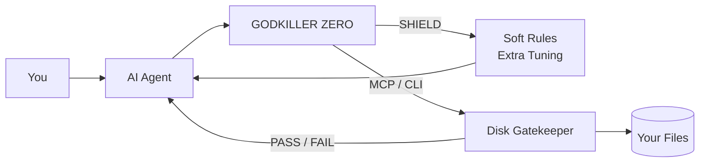
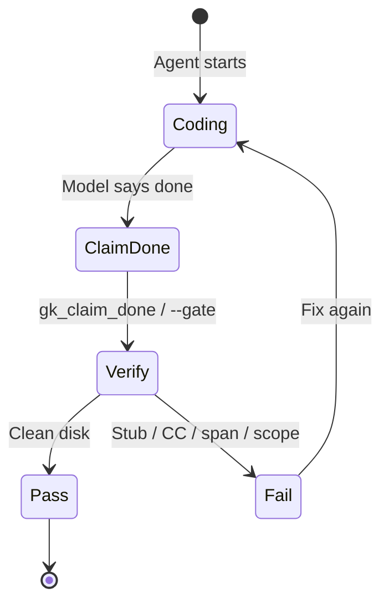
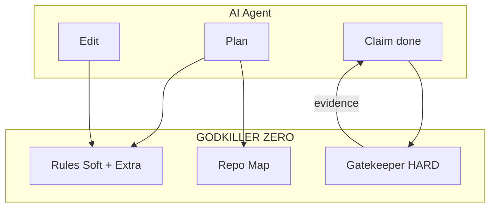

<p align="center">
  
</p>

<h1 align="center">GODKILLER ZERO</h1>

<p align="center">
  <strong>The Guardrail Layer for AI Coding</strong><br/>
  <em>Let AI <b>BUILD</b>. Make GODKILLER <b>VERIFY</b>.</em>
</p>

<p align="center">
  <code>DONE IS NOT EVIDENCE.</code>
  &nbsp;·&nbsp;
  <code>Less tokens. More control.</code>
</p>

<p align="center">
  <a href="https://github.com/taurus42119-stack/GODKILLER-ZERO/releases/latest"></a>
  <a href="LICENSE"></a>
  
  
</p>

<p align="center">
  <b>Works with</b><br/>
  
  
  
  
</p>

<p align="center">
  <a href="https://www.instagram.com/kayvins.th">@kayvins.th</a>
</p>

---

## Why it exists

AI can code.  
It should not be allowed to break your project — then claim **done**.

<table>
  <tr>
    <th width="50%">Without ZERO</th>
    <th width="50%">With ZERO</th>
  </tr>
  <tr>
    <td align="center">vibe edits</td>
    <td align="center"><b>targeted scope</b></td>
  </tr>
  <tr>
    <td align="center">“finished” on hope</td>
    <td align="center"><b>disk verification</b></td>
  </tr>
  <tr>
    <td align="center">silent spaghetti</td>
    <td align="center"><b>complexity / stub gates</b></td>
  </tr>
  <tr>
    <td align="center">dump the whole repo</td>
    <td align="center"><b>deep project radar</b></td>
  </tr>
  <tr>
    <td align="center">long, unfocused agent loops</td>
    <td align="center"><b>tighter aim · fewer wasted turns</b></td>
  </tr>
</table>

---

## Field signal (Cursor Usage)

Same model. New chat both sides. Same task prompt.

| | Tokens |
| :---: | :---: |
| Before SHIELD | **585K** |
| After SHIELD | **241.1K** |
| Delta | **~59% lower** on that run |

Model: `cursor-grok-4.6-high` · Source: Cursor Usage log

> Not a lab benchmark. One controlled session. Your mileage will vary — but the direction matched what Zero Fluff + Target + Scope are built for: less wandering, more hit.

---

## How it works





Three planes:

| Plane | What | Force |
| :--- | :--- | :---: |
| **Soft rules** | Injected into Cursor / Claude / Gemini hosts | Behavioral |
| **HARD gate** | `godkiller-console --gate` / `gk_gatekeeper_scan` | Disk |
| **MCP tools** | `gk_claim_done` · `gk_gatekeeper_scan` · `gk_get_repo_map` | Protocol |

---

## Control surface

| Mode | Name | Feel |
| :---: | :--- | :--- |
| **SHI** | Silent | Max autonomy |
| **KEN** | Balanced | Confirm breaking changes |
| **SHIN** | Turbo | Deep architect pressure |
| **EXTRA** | Tuning | Flip every invariant |

| Action | Effect |
| :--- | :--- |
| **SHIELD** | Arm rules + MCP across hosts |
| **RESTORE** | Strip ZERO only — peer MCPs stay |

---

## Feature pillars

<table>
<tr>
<td width="50%" valign="top">

### 1. AI Guardrails
Set boundaries **before** the model touches code.

`Target · Scope · Stack · Architecture`

| Extra toggle | Job |
| :--- | :--- |
| Zero Hallucination | Halt assumptions |
| Ghost Edit Shield | Never touch untouched code |
| Stack Sensor | Align to real manifests |
| Thai Precision | Honor ห้าม / อย่า |

</td>
<td width="50%" valign="top">

### 2. Verify Before Done
Real filesystem check — not a chat claim.

`Code · Scope · Complexity · Stub`

```text
VERIFY
 ✓ Code Quality
 ✓ Scope Check
 ✓ Complexity   (CC ≤ 7)
 ✓ No Stub
 ✓ Disk State
 ✓ Span ≤ 70
```

| Extra toggle | Job |
| :--- | :--- |
| Bite-Sized Functions | Cap span |
| Frictionless Logic | Kill if-else pyramids |
| Crash Immunity | Ban unwrap / empty catch |
| Clean Architecture | No junk drawers |

</td>
</tr>
<tr>
<td width="50%" valign="top">

### 3. Blast Radius Radar
See what breaks **before** you edit.

`Dependency · Caller · Impact`

| Extra toggle | Job |
| :--- | :--- |
| Blast Radius Radar | Audit callers first |
| Self-Documenting Code | Ban `data` / `res` / `req` |

</td>
<td width="50%" valign="top">

### 4. Loop Breaker
Stop repeat “still failing” loops.

`Log · Diagnose · Fix`

| Extra toggle | Job |
| :--- | :--- |
| Loop Breaker | Halt guess cycles |
| Instant Delivery | Zero fluff / chitchat |

</td>
</tr>
<tr>
<td width="50%" valign="top">

### 5. Deep Project Radar
Understand the repo without dumping it.

`Map · Target · Context · Plan`

| Extra toggle | Job |
| :--- | :--- |
| Deep Project Radar | `gk_get_repo_map` |
| Spatial Wireframing | ASCII plans |
| Flowchart Generator | Mermaid flows |

Cadence: **Fast** (plans only) · **Normal** (more diagrams)

</td>
<td width="50%" valign="top">

### Bonus architecture knobs

| Extra toggle | Job |
| :--- | :--- |
| Decoupled Core | Pure logic vs I/O |
| Modern Web Standards | Prefer current docs |
| Designer-Grade UI | Tokens / motion / dark |
| Proactive Roadmap | Next phases after green |

</td>
</tr>
</table>



---

## Extra Tuning — full board

One SHIELD. Nineteen levers.

| # | Toggle | Pillar |
| ---: | :--- | :--- |
| 1 | Zero Hallucination | Guardrails |
| 2 | Self-Documenting Code | Blast / Quality |
| 3 | Clean Architecture | Verify |
| 4 | Instant Delivery | Loop / Tokens |
| 5 | Spatial Wireframing | Radar / Plan |
| 6 | Flowchart Generator | Radar / Plan |
| 7 | Bite-Sized Functions | Verify |
| 8 | Frictionless Logic | Verify |
| 9 | Blast Radius Radar | Blast |
| 10 | Stack Sensor | Guardrails |
| 11 | Ghost Edit Shield | Guardrails |
| 12 | Loop Breaker | Loop |
| 13 | Crash Immunity | Verify |
| 14 | Decoupled Core | Architecture |
| 15 | Modern Web Standards | Architecture |
| 16 | Designer-Grade UI | Architecture |
| 17 | Proactive Roadmap | Architecture |
| 18 | Thai Precision | Guardrails |
| 19 | Deep Project Radar | Radar |

Hard floor on disk (always available via CLI / MCP):

- Cyclomatic complexity **≤ 7**
- Function span **≤ 70**
- No lazy stubs / banned generics

---

## Get it

### Download

**[→ Latest Windows release](https://github.com/taurus42119-stack/GODKILLER-ZERO/releases/latest)**

1. Unzip `godkiller-zero-windows-x86_64.zip`  
2. Run `GodkillerZero.exe`  
3. Click **SHIELD**  
4. Open **EXTRA** — flip only what you need

### One-liner

```powershell
irm https://raw.githubusercontent.com/taurus42119-stack/GODKILLER-ZERO/main/install.ps1 | iex
```

---

## Build from source

Needs **Rust** + **.NET SDK 9+**

```powershell
.\build.ps1
```

```text
publish\
  GodkillerZero.exe
  godkiller-console.exe
```

```powershell
godkiller-console --gate .
godkiller-console --repo-map .
godkiller-console --mcp
```

| MCP tool | Role |
| :--- | :--- |
| `gk_gatekeeper_scan` | Hygiene / CC / span / stubs |
| `gk_get_repo_map` | Compact project skeleton |
| `gk_claim_done` | Outbound “done” with disk proof |

---

## What you get

| | |
| :--- | :--- |
| **Stronger security** | Block risky / out-of-scope edits |
| **Lower wasted usage** | Fewer unfocused loops · smarter context |
| **Better code quality** | CC / span / stub discipline on disk |
| **Full control** | Your rules. Your Extra board. |
| **Open source** | MIT |

---

## License

MIT — free to use, fork, and ship. See [LICENSE](LICENSE).

---

<p align="center">
  <strong>Less chaos. More control.</strong><br/>
  <sub>Built to kill vibe-coding — not creativity.</sub><br/>
  <sub>@kayvins.th</sub>
</p>
