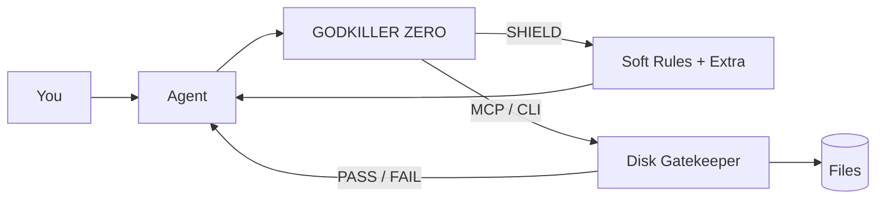

<p align="center">
  
</p>

<br/>

<p align="center">
  <a href="https://github.com/taurus42119-stack/GODKILLER-ZERO/releases/latest"></a>
  &nbsp;
  <a href="LICENSE"></a>
  &nbsp;
  
</p>

<p align="center">
  <b>The Guardrail Layer for AI Coding</b><br/>
  <i>Let AI build. Make GODKILLER verify.</i>
</p>

<p align="center">
  <code>DONE IS NOT EVIDENCE.</code>
</p>

<p align="center">
  Cursor · Claude · Gemini · Antigravity
  &nbsp;·&nbsp;
  <a href="https://www.instagram.com/kayvins.th">@kayvins.th</a>
</p>

---

## Why

AI can code. It should not break your project — then claim **done**.

| ❌ Without ZERO | ✅ With ZERO |
| :--- | :--- |
| vibe edits | targeted scope |
| “finished” on hope | disk verification |
| silent spaghetti | CC ≤ 7 · span ≤ 70 · no stubs |
| dump the whole repo | deep project radar |
| long unfocused loops | tighter aim |

---

## Usage lab · Cursor

Same task style. **New chat** each run. Same family of prompts.  
Compare **without SHIELD** vs **with SHIELD**.

| Model | Without | With | Change | Fit |
| :--- | ---: | ---: | ---: | :--- |
| **Gemini 3.8 Flash** | 159.8K | 55.6K | **-65.2%** | 🔥 Best cut |
| **Grok 4.6 High** | 585.0K | 241.1K | **-58.8%** | 🔥 Excellent |
| **Claude Opus 5 Thinking** | 705.7K | 362.3K | **-48.7%** | 💪 Huge absolute save |
| **GPT 5.6 Sol Medium** | 171.5K | 172.7K | **~0%** | 😐 Already terse |

```mermaid
xychart-beta
  title "Tokens per run (K) — Without vs With ZERO"
  x-axis ["Gemini", "Grok", "Claude", "GPT"]
  y-axis "Tokens (K)" 0 --> 750
  bar [160, 585, 706, 172]
  bar [56, 241, 362, 173]
```



### What that means

| Rank | Model | Why ZERO fits |
| :---: | :--- | :--- |
| 1 | **Gemini Flash** | Biggest % drop when focus locks in |
| 2 | **Grok High** | Was wandering hard; SHIELD cuts the tour |
| 3 | **Claude Opus** | Still heavy, but nearly **halved** |
| 4 | **GPT Medium** | Short by default — little fat to trim |

> Lab notes, not a peer-reviewed benchmark. Absolute tokens depend on task size. Direction is clear on Flash / Grok / Opus.

---

## How it works



| Plane | Force | Examples |
| :--- | :---: | :--- |
| Soft rules | Behavior | fluff ban · scope · blast · loops |
| HARD gate | Disk | `--gate` · `gk_gatekeeper_scan` |
| MCP | Protocol | `gk_claim_done` · `gk_get_repo_map` |

---

## Control

| | | |
| :---: | :--- | :--- |
| **SHI** | Silent | max autonomy |
| **KEN** | Balanced | confirm breaking changes |
| **SHIN** | Turbo | deep architect pressure |
| **EXTRA** | Tuning | 19 individual levers |

**SHIELD** arm · **RESTORE** disarm (peer MCPs untouched)

---

## Pillars

### 1 · AI Guardrails
Boundaries before edits.  
`Target · Scope · Stack · Architecture`

Zero Hallucination · Ghost Edit Shield · Stack Sensor · Thai Precision

### 2 · Verify Before Done
Filesystem proof — not chat hope.

```text
VERIFY
 ✓ Code Quality     ✓ Scope
 ✓ Complexity ≤ 7   ✓ Span ≤ 70
 ✓ No Stub          ✓ Disk State
```

Bite-Sized Functions · Frictionless Logic · Crash Immunity · Clean Architecture

### 3 · Blast Radius Radar
See breakages before you touch them.  
`Dependency · Caller · Impact`

### 4 · Loop Breaker
Kill “still failing” guess cycles. Demand logs.  
Instant Delivery · Loop Breaker

### 5 · Deep Project Radar
Map the repo — don’t dump it.  
`gk_get_repo_map` · ASCII plans · Mermaid flows  
Cadence: **Fast** (plans) · **Normal** (more diagrams)

---

## Extra board · 19 levers

| | Toggle | | Toggle |
| :---: | :--- | :---: | :--- |
| 01 | Zero Hallucination | 11 | Ghost Edit Shield |
| 02 | Self-Documenting Code | 12 | Loop Breaker |
| 03 | Clean Architecture | 13 | Crash Immunity |
| 04 | Instant Delivery | 14 | Decoupled Core |
| 05 | Spatial Wireframing | 15 | Modern Web Standards |
| 06 | Flowchart Generator | 16 | Designer-Grade UI |
| 07 | Bite-Sized Functions | 17 | Proactive Roadmap |
| 08 | Frictionless Logic | 18 | Thai Precision |
| 09 | Blast Radius Radar | 19 | Deep Project Radar |
| 10 | Stack Sensor | | |

---

## Get it

**[Download for Windows →](https://github.com/taurus42119-stack/GODKILLER-ZERO/releases/latest)**

1. Unzip  
2. Run `GodkillerZero.exe`  
3. Hit **SHIELD**  
4. Open **EXTRA** — enable only what you need  

```powershell
irm https://raw.githubusercontent.com/taurus42119-stack/GODKILLER-ZERO/main/install.ps1 | iex
```

---

## Build

Rust + .NET SDK 9+

```powershell
.\build.ps1
```

```powershell
godkiller-console --gate .
godkiller-console --repo-map .
godkiller-console --mcp
```

| Tool | Role |
| :--- | :--- |
| `gk_gatekeeper_scan` | hygiene · CC · span · stubs |
| `gk_get_repo_map` | compact skeleton |
| `gk_claim_done` | done ≠ evidence |

---

<p align="center">
  <b>Less chaos. More control.</b><br/>
  <sub>MIT · Built to kill vibe-coding — not creativity · @kayvins.th</sub>
</p>
