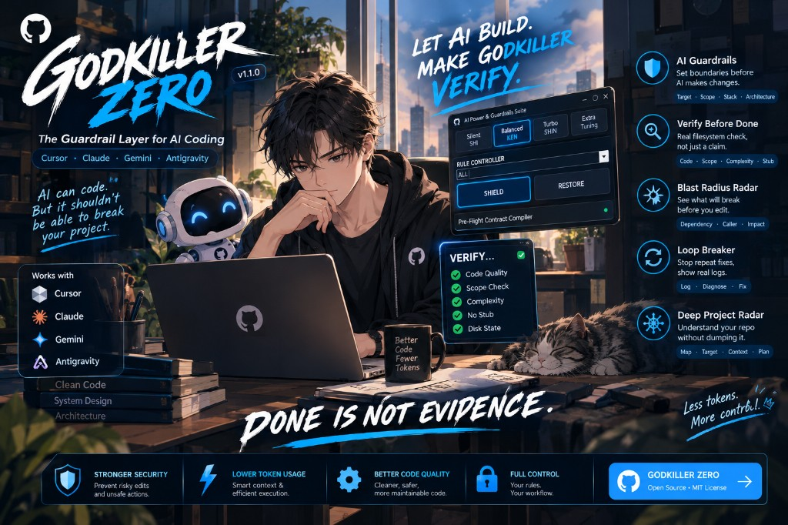
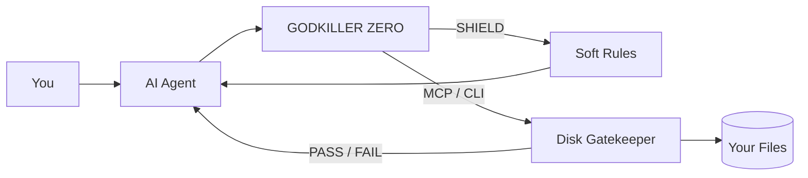
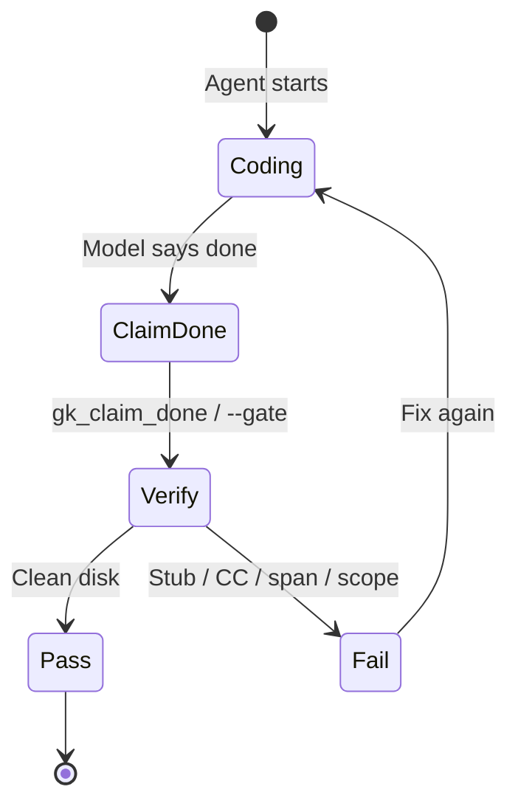
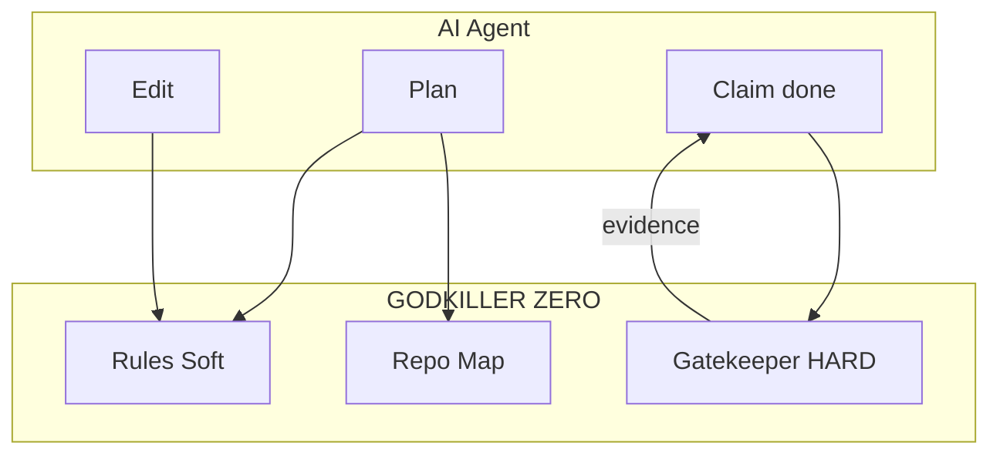

<p align="center">
  
</p>

<h1 align="center">GODKILLER ZERO</h1>

<p align="center">
  <strong>The Guardrail Layer for AI Coding</strong><br/>
  <em>Let AI build. Make GODKILLER verify.</em>
</p>

<p align="center">
  <code>DONE IS NOT EVIDENCE.</code>
</p>

<p align="center">
  <a href="https://github.com/taurus42119-stack/GODKILLER-ZERO/releases/latest"></a>
  <a href="LICENSE"></a>
  
</p>

<p align="center">
  Works with&nbsp;
  
  
  
  
</p>

<p align="center">
  <a href="https://www.instagram.com/kayvins.th">@kayvins.th</a>
</p>

---

## Why it exists

AI can code.  
It should not be allowed to break your project — then claim **done**.

| Without ZERO | With ZERO |
| :---: | :---: |
| vibe edits | targeted scope |
| “finished” on hope | disk verification |
| silent spaghetti | complexity / stub gates |
| dump the whole repo | deep project radar |

---

## How it works





---

## Control surface

| Mode | Name | Feel |
| :---: | :--- | :--- |
| **SHI** | Silent | Max autonomy |
| **KEN** | Balanced | Confirm breaking changes |
| **SHIN** | Turbo | Deep architect pressure |
| **EXTRA** | Tuning | Flip individual invariants |

Primary actions:

- **SHIELD** — arm rules + MCP across hosts  
- **RESTORE** — remove ZERO hooks only (peer MCPs stay)

---

## Feature pillars

### 1. AI Guardrails
Set boundaries before the model touches code.  
`Target · Scope · Stack · Architecture`

### 2. Verify Before Done
Real filesystem check — not a chat claim.  
`Code · Scope · Complexity · Stub`

```text
VERIFY
 ✓ Code Quality
 ✓ Scope Check
 ✓ Complexity
 ✓ No Stub
 ✓ Disk State
```

### 3. Blast Radius Radar
See what breaks before you edit.  
`Dependency · Caller · Impact`

### 4. Loop Breaker
Stop repeat “still failing” loops — demand real logs.  
`Log · Diagnose · Fix`

### 5. Deep Project Radar
Understand the repo without dumping it.  
`Map · Target · Context · Plan`



---

## Get it

### Download

**[→ Latest Windows release](https://github.com/taurus42119-stack/GODKILLER-ZERO/releases/latest)**

1. Unzip `godkiller-zero-windows-x86_64.zip`  
2. Run `GodkillerZero.exe`  
3. Click **SHIELD**

### One-liner

```powershell
irm https://raw.githubusercontent.com/taurus42119-stack/GODKILLER-ZERO/main/install.ps1 | iex
```

---

## Build from source

Needs **Rust** + **.NET SDK 9+**

```powershell
.\build.ps1
```

Output:

- `publish\GodkillerZero.exe`
- `publish\godkiller-console.exe`

CLI essentials:

```powershell
godkiller-console --gate .
godkiller-console --repo-map .
godkiller-console --mcp
```

---

## What you get

| | |
| :--- | :--- |
| **Stronger security** | Block risky / out-of-scope edits |
| **Smarter context** | Map the repo instead of dumping files |
| **Better code quality** | CC / span / stub discipline on disk |
| **Full control** | Your rules. Your workflow. |
| **Open source** | MIT |

> Token impact depends on workflow. Soft rules add system prompt cost; fewer failed loops and less file-dumping often reduce total usage. Measure on your own Cursor Usage if you need numbers.

---

## License

MIT — free to use, fork, and ship. See [LICENSE](LICENSE).

---

<p align="center">
  <strong>Less chaos. More control.</strong><br/>
  <sub>Built to kill vibe-coding — not creativity.</sub>
</p>
